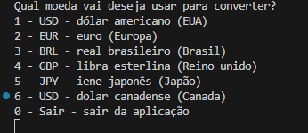
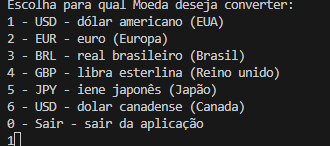
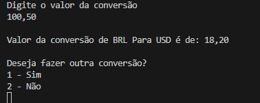

# Conversor de moedas

## Descrição
Aplicação que converte moeda para outras moedas de escolha do usuário.

## 🔨 Objetivos do projeto

- Desenvolver um Conversor de Moedas que ofereça interação textual (via console) com os usuários, proporcionando no mínimo 6 opções distintas de conversões de moedas em um menu.

## 🔨 Ferramentas e bibliotecas
- Linguagem de programção usado foi o ``` Java ```
- Foi suado biblioteca  ``` Gson ```. Essa biblioteca não vem no java padrão é uma biblioteca externa. Ele converte dados do formato JSON para objetos


## ⭐ Funcinamento da aplicação
- A aplicação funciona da seguinte maneira.
 O usuário digite a numeração da moeda que ela quer converter entre as opções mostradas
    - 
- Depois de selecionar vai mostrar outro menu identico pergunta para qual moeda deseja converte. Ex: BRL (real) para EUA (dolar)
    - 
- Em seguinda é é perguntado qual o valor das moedas selecionadas. Ex: BRL -> EUA.
    - Aceita por padrão entradas como 100, 100,55, e 1.100,55.
    
    sempre vai vir com duas casas decimais

## Desafios no desenvolvimento
### excessões de erros
- Tive um pouco de dificuldade nas exceções de erros na parte de digitação de usuário, como digitar um número negativo ou digitar letras.
    - A solução que coloquei foi colocar uma condição de numerção de 0 a 6.
- Tive um pouco de dificuldade na hora de fazer a conversão para que o resultado esteja nas casas decimais.
    - A solução que usei foi usar uma formação simples, pesquisando na internet me lembrei que quando usava java a muito tempo usava o ```String.format("%2.f")``` para colocar limite de duas casas decimasi.
